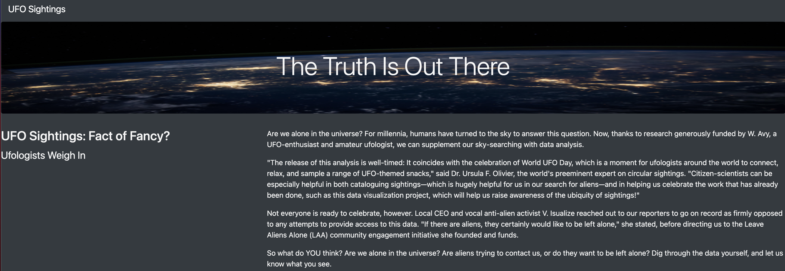
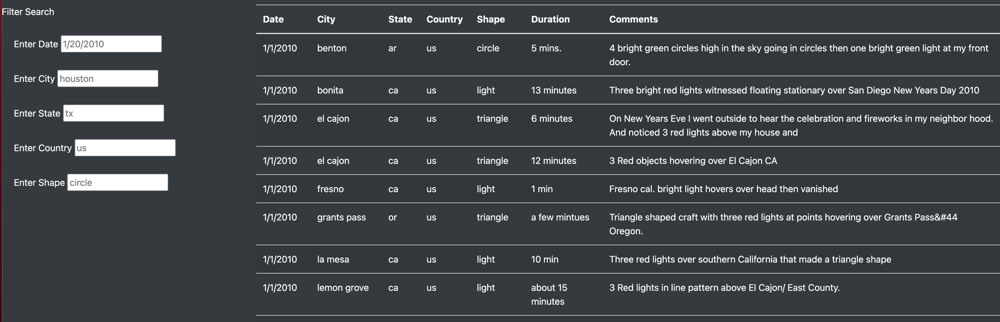

# UFOs

## Overview of Project
### Purpose

The purpose of this project is to using HTML and JavaScript to build a webpage along with dynamic table in order to provide a deep analysis of UFO sightings by allowing users to filter to multiple criteria at the same time.

## Results

Once enter the website, the title and a short paragraph of description are located on the top of the webpage. As scrolling down the webpage, the filter search input boxes are next to the table of UFO sightings.

Within the table, there are Date, City, State, Country, Shape, Duration, and Comments columns. Users can filter the table based on their own interest. The table can be filtered by Date, City, State, Country and Shape. The filters work very user friendly and easy to understand. They can either choose any of these filters or multiple filters can be chosen simultaneously by simply typing the information in the text box and press enter key on their keyboard. After they input the filter information, the table would be updated and only shown the data with their specific interests.

## Summary

-	One drawback of this webpage:

  One drawback of this webpage is that all the data in the table is displayed on the same page.

- Two additional recommendations for further development:
  
  1. Since the dataset is large, instead of scrolling down to see all the data and showing them in one page, the table can be updated to multiply pages, which can make the website more organized and has a clearer look.
  2. The data in comments column can be compressed and only shows the first couple of words with a “more information” button. If user would like to read the comments in more details, they can click on the button to see the whole comment.
